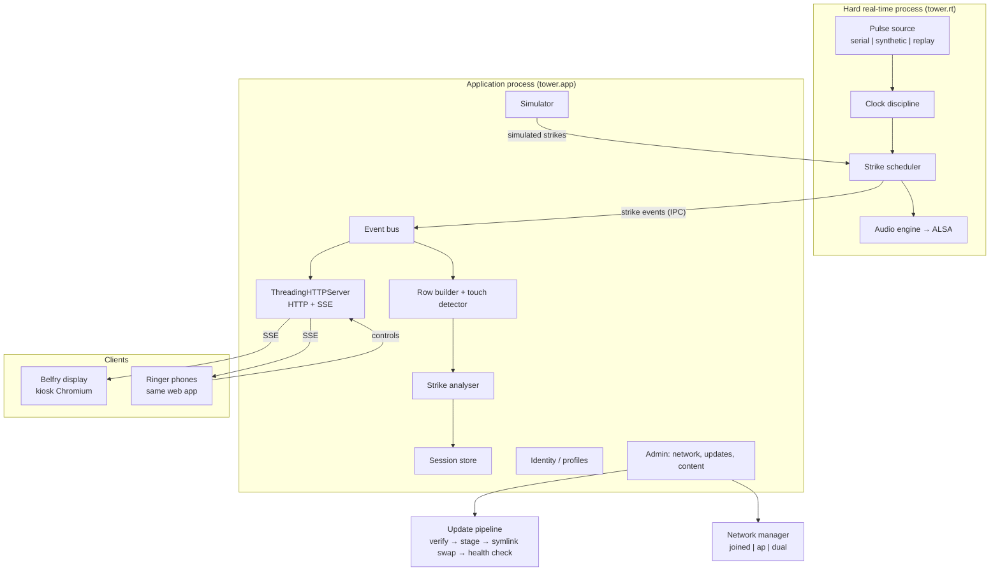

# Tower System — High-Level Design, Component Designs, and Implementation Plan

Status: draft 1 of the consolidated design (supersedes nothing; sits above the running design notes)
Scope: Raspberry Pi tower information board, bell simulator, and strike analyser, distributable to multiple towers

---

## 1. High-level design

### 1.1 What the system is

A single Raspberry Pi in a tower that does four jobs:

1. **Sounds bells** in response to a photohead sensor, so a band can ring on tied bells or with a mix of real and simulated bells.
2. **Analyses striking** in real time and retrospectively, producing per-touch and per-bell accuracy figures.
3. **Shows information** — a notice board, the current touch, the last touch's scores — on a wall display in the ringing chamber and on ringers' phones.
4. **Keeps history** — raw strike streams, touches, and per-ringer statistics over time.

### 1.2 The constraints that shape everything

| Constraint | Consequence |
|---|---|
| Must be distributable to arbitrary towers | No tower-specific code paths. Everything tower-specific lives in config or content, not in the image. |
| Home tower has no WiFi | The Pi is its own access point. Content arrives by phone-as-courier or USB, not by pull. |
| Audio timing must be perceptually exact | Hard real-time path (sensor → audio) is strictly separated from the loose real-time path (events → display). |
| Ringers can't be asked to re-pair or fiddle | Joining is a QR code. Display is a browser. No app install required, and no native app: the web app is the only client. |
| One SD card image for bench and tower | No environment-specific builds. Behaviour differences come from runtime detection and config only. |
| Updates go out to towers the maintainer cannot physically reach | Atomic, signed, self-verifying, auto-rollback updates. No reflashing. |

### 1.3 Timing tiers

This is the central architectural split and it decides which component owns what.

- **Hard real-time (sub-10 ms):** photohead reads, clock discipline, strike scheduling, ALSA output. Single process, no browser, no HTTP, no Python GC pressure in the hot loop if avoidable.
- **Loose real-time (\~50 ms budget):** SSE event stream to browsers, display animation, live analyser readout. Cosmetic. Dropping events here degrades animation, never audio.
- **Not real-time:** session persistence, metric derivation, statistics, content updates, network management.

Nothing in the loose or non-real-time tiers may sit between a sensor pulse and its sound.

### 1.4 Process topology



Two processes, not one and not ten. The split is at the timing boundary. IPC between them is a one-way local socket carrying the event contract; the application process may never block the RT process.

### 1.5 Component inventory

| # | Component | Tier | Module |
|---|---|---|---|
| C1 | Pulse source (serial / synthetic / replay) | hard RT | `tower.rt.source` |
| C2 | Clock discipline | hard RT | `tower.rt.clock` |
| C3 | Strike scheduler | hard RT | `tower.rt.sched` |
| C4 | Audio engine + sound packs | hard RT | `tower.rt.audio` |
| C5 | Event bus + contract | boundary | `tower.events` |
| C6 | Row builder + touch detector | app | `tower.ringing.rows` |
| C7 | Strike analyser | app | `tower.analysis.hawkear` |
| C8 | Session store + metrics | app | `tower.store` |
| C9 | Simulator + method library | app | `tower.sim`, `tower.methods` |
| C10 | Web server (HTTP + SSE) | app | `tower.web.server` |
| C11 | Web app (phone + kiosk) | client | `tower/web/static` |
| C12 | Identity and statistics | app | `tower.identity` |
| C13 | Notice board / announcements | app | `tower.board` |
| C14 | Content delivery (courier + pull) | app | `tower.content` |
| C15 | Update pipeline | app | `tower.release` |
| C16 | Network manager | app | `tower.net` |
| C17 | Config and admin | app | `tower.config`, `tower.web.admin` |

### 1.6 Durable interface contracts

Five schemas that outlive any implementation and must be versioned from day one. Each gets a `schema_version` field and a documented compatibility rule.

1. **Sound pack manifest** — bells, files, per-bell gain and offset, provenance.
2. **Announcement frontmatter** — title, dates, priority, expiry, audience.
3. **Event envelope** — the strike/row/state message shape. Transport-agnostic: SSE today, possibly WebSocket later.
4. **Session file format** — the raw strike stream on disk.
5. **Per-user touch summary** — what a ringer's stats are derived from.

---

## 2. Component designs

### C1 — Pulse source

**Purpose.** Turn whatever the hardware emits into `PulseEvent`s on a single contract, so that live, synthetic, and replay sources are interchangeable everywhere downstream.

**Interface.**

```python
class PulseSource(Protocol):
    def __iter__(self) -> Iterator[PulseEvent]: ...

@dataclass(frozen=True, slots=True)
class PulseEvent:
    bell: int            # 1..16, bell number as rung
    t_src: float         # source timebase seconds (MCU clock if available)
    t_rx: float          # Pi monotonic at receipt
    seq: int
```

**Live source.** Photohead box over USB serial at 2400 baud. Device resolved by VID/PID through `serial.tools.list_ports`, never by a hardcoded `/dev/ttyUSB0`.

**Known hardware quirks, each with an explicit mitigation:**

- _USB latency timer._ FTDI default of 16 ms introduces variable jitter well above the perceptual threshold. Mitigation: write `1` to `/sys/bus/usb-serial/devices/<dev>/latency_timer` at startup, via a udev rule shipped in the image, and assert the value at source open. Log loudly and continue degraded if it can't be set.
- _Bells 11 and 12 dropped._ The serial protocol distinguishes bells by character case; lowercase handling silently loses these bells. Mitigation: decode as raw bytes with an explicit character map covering the whole range, plus a source-level unit test asserting all 16 bells round-trip.

**Synthetic source.** `--source=synthetic` generates pulse trains with configurable gap, uplift, and per-bell error, driven by an injected clock. No hardware, fully deterministic, runs in CI.

**Replay source.** Reads a session file and re-emits at original or accelerated rate. This is how analyser changes get regression-tested against real ringing.

**Testing.** Golden byte streams captured from the real box, replayed through the decoder. Property test: every bell 1..16, both cases, decodes uniquely.

---

### C2 — Clock discipline

**Purpose.** Map microcontroller timestamps onto the Pi's monotonic clock without inheriting serial transport jitter.

**Principle.** Timestamp at the microcontroller, not the Pi. Serial delay is one-sided: transport can only add delay, never remove it. So the minimum observed `t_rx - t_src` over a window is the best estimate of the true offset.

**Algorithm.**

- Maintain a sliding window (say 60 s) of `delta_i = t_rx_i - t_src_i`.
- `offset = min(window)`; optionally fit slope over a longer window to track crystal drift between MCU and Pi.
- `t_strike_base = t_src + offset`.
- Re-seed on gaps longer than the window.

**Failure mode to guard.** A single anomalously early sample (clock glitch, wrap) poisons the minimum. Use a low percentile (e.g. 2nd) rather than a strict minimum, or reject samples more than N sigma below the running estimate.

**Clock injection.** No component calls `time.monotonic()` inline. A `Clock` protocol is passed in everywhere, with `SystemClock` in production and `FakeClock` in tests. This is what makes the whole timing stack testable.

---

### C3 — Strike scheduler

**Purpose.** Decide when each bell should sound and hand that time to the audio engine early enough to be exact.

**Model.** A pulse is not a strike. The photohead fires when the bell passes the sensor; the clapper strikes a fixed interval later, determined by the bell's swing. So:

```
t_strike = t_pulse_disciplined + offset_bell(stroke)
```

`offset_bell` is per bell and per stroke (handstroke and backstroke differ), calibrated per tower.

**Stroke inference.** Alternate from a seed. Seed from the first row of a touch (handstroke leads) or from an explicit control. Re-seed on any gap that ends a touch. Do not attempt to infer stroke from rotation direction unless the sensor reports it.

**Scheduling.** Strikes are queued into the audio engine's future-events list with at least one audio period of lead time. If the computed strike time is already in the past (late pulse), play immediately and record the lateness as a metric rather than dropping the blow.

**Simulated bells.** The simulator feeds strike requests into the same scheduler. Real and simulated bells share one timebase and one output mix, which is the only way a mixed touch sounds right.

---

### C4 — Audio engine and sound packs

**Purpose.** Produce a bell sound at a specified monotonic time with sub-10 ms accuracy and correct overlap.

**Design.**

- All samples pre-decoded to raw PCM in RAM at startup. Typical ring is 13–40 MB, comfortably resident.
- One ALSA playback stream. Mixing is done in-process by summing active voices into the period buffer; one stream per bell does not give reliable inter-bell timing.
- Fixed small period size (e.g. 128 or 256 frames at 44.1 kHz) with a period-count of 2 or 3. Scheduling resolution is one period; the residual is handled by sample-accurate offset placement within the buffer.
- Voice allocation: bells overlap heavily in a long ring. Allocate a generous fixed voice pool; steal the oldest voice on exhaustion and count the steal.
- Per-bell gain from the manifest; global volume from config.

**Open decision.** Stdlib-only is the project default but there is no stdlib ALSA. Options, in preference order:

1. `ctypes` binding to `libasound` for just the dozen calls needed. Keeps the dependency list at zero, costs a day of fiddly work, and keeps full control of period timing.
2. `pyalsaaudio` — small, C, packaged in Debian, does exactly this.
3. `sounddevice`/PortAudio — adds a layer that is harder to reason about for timing.

Recommendation: start with option 2 to get sound working in M2, keep the engine behind an interface, and swap to option 1 later if the dependency proves annoying to distribute.

**Sound pack manifest (contract 1).**

```yaml
schema_version: 1
id: tower-8-taylor
name: "Taylor 8, 12cwt"
sample_rate: 44100
bells:
  - number: 1
    file: bell01.wav
    gain_db: 0.0
    strike_offset_ms: { hand: 0, back: 0 }
provenance: { source: "...", licence: "..." }
```

**Calibration.** Offsets are calibrated by ear: ring open with the simulator sounding at the same time and adjust until the two coincide. The UI exposes a per-bell nudge in 5 ms steps during a calibration mode, writing back to tower config (not to the shipped sound pack).

**Testing.** A loopback capture harness measures scheduled-vs-actual strike time on the Pi and asserts jitter under 10 ms over a few thousand blows. Not run in CI; run on the desk Pi as a gate before any audio-path release.

---

### C5 — Event bus and contract

**Purpose.** One event contract for live, mock, and replay, consumed identically by the analyser, the store, and the web layer.

**Envelope (contract 3).**

```json
{
  "schema_version": 1,
  "type": "strike",
  "seq": 10423,
  "t": 1234.5678,
  "payload": { "bell": 3, "stroke": "hand", "source": "live" }
}
```

Types: `strike`, `row`, `touch_start`, `touch_end`, `analysis`, `state`, `board`, `system`.

**Transport.** RT process → app process over a local Unix datagram socket, one JSON line per event. App process → browsers over SSE. Same envelope both hops.

**Backpressure.** Per-client bounded queue with drop-oldest semantics. A phone on a bad connection must never stall the broadcast to the wall display. Dropped counts are surfaced in the admin view; clients reconcile on reconnect by requesting current state rather than replaying history.

**Server.** `ThreadingHTTPServer`, not stdlib `HTTPServer` — the latter blocks on held-open SSE connections and the whole thing wedges on the second client.

---

### C6 — Row builder and touch detector

**Purpose.** Turn a stream of strikes into rows, and rows into touches, without being told in advance what is being rung.

**Bell set discovery.** Observe the first several strikes; the set of distinct bells sounding is the working set. Handles 6 out of 8, an odd bell missing, and covers without configuration.

**Row building.** A row is `n` strikes, one per bell in the working set. Handle a bell that fails to sound (miss) and a bell that sounds twice (double) without derailing the row boundary — anchor on stroke alternation and elapsed time rather than a strict count.

**Touch detection.** The 10-row rule: a sequence of 10 or more contiguous rows is a touch. Fewer is rounds-and-fiddling and is not recorded as a touch. A gap longer than the configured threshold ends the touch.

**Why retrospective.** Touch boundaries and method attribution are decided after the fact, which means no one has to press start and stop. This is the single biggest usability decision in the system and everything downstream must tolerate it: live analysis is provisional, stored analysis is authoritative.

---

### C7 — Strike analyser

**Purpose.** Score striking against an ideal, in a way ringers recognise.

**Model (Hawkear-style).** Within a window, the ideal time of the `i`-th blow of a row is linear:

```
t_ideal(i, row) = a + b · k + c · u
```

where `k` is the global blow index, `b` the inter-bell gap, `c` the handstroke uplift, `u` the handstroke indicator, and `a` the phase. Fitting `a, b, c` by least squares over the window reduces to a 3×3 normal-equations solve — small enough to do in plain Python with no numpy.

**Two variants, both implemented in `hawkear_rt.py`:**

- _Windowed retrospective._ Refits over a fixed window of rows. Used for stored analysis and for the authoritative score.
- _Alpha-beta filter._ Tracks gap and phase incrementally. Used for the live readout, where a fit that lags by half a window feels wrong.

They will not agree exactly. The stored score is the one that counts; the live one is labelled as provisional in the UI.

**Outputs per blow:** error in ms, error as a fraction of the ideal gap, place in row.
**Outputs per bell per touch:** mean error (odd-struckness proxy), standard deviation (consistency), fault count above a threshold, handstroke/backstroke split.
**Outputs per touch:** band RMS, rhythm stability (variance of fitted `b` over windows), uplift consistency.

**Grading.** Open question. Whatever grading function ships, every stored summary carries `grading_version`, and metrics are derived on read, so a revised grading scheme can be applied retrospectively to all historical sessions without a migration.

---

### C8 — Session store and metrics

**Purpose.** Keep the raw truth; derive everything else.

**Principle.** Store raw strike streams. Never store a computed score as the only record of a touch. Metrics are derived on read, which means an analyser improvement improves history too.

**Session file format (contract 4).** Append-only JSONL, one file per session, under `/var/lib/tower/sessions/YYYY/MM/`:

```
{"schema_version":1,"type":"header","started":"2026-09-19T19:31:02Z","tower":"...","sound_pack":"...","software":"1.4.2"}
{"type":"strike","seq":1,"t":0.000,"bell":1,"stroke":"hand","source":"live"}
...
```

Append-only means a power cut costs at most the current blow. A separate small index file per month holds derived touch summaries as a cache, regenerable from the raw stream at any time.

**Retention.** Raw streams are small (a 45-minute practice is well under a megabyte). Keep everything; revisit only if an SD card fills.

---

### C9 — Simulator and method library

**Purpose.** Ring the bells that aren't being rung by people.

**Method library.** The CCCBR method library, filtered to what's plausible in a tower and shipped with releases. No network lookup at ring time.

**Row generation.** Standard place-notation expansion. Calls (bob, single) applied at lead ends. The simulator generates rows ahead of time and issues strike requests to the scheduler on the beat, adjusting to the human ringers' pace.

**Pace tracking.** The simulator must follow the band, not lead it. Track the fitted inter-bell gap from the analyser (the alpha-beta variant, because it's live) and place simulated blows on that grid. A simulator that ignores the band's speed is worse than no simulator.

**No conductor lock.** Any connected phone can change the method, speed, or which bells are simulated. Last write wins. The admin PIN scopes network and system management, not the simulator and not the notice board. This is a social problem, not a technical one, and a lock would cause more grief than it prevents.

**State.** Simulator state is a single small document broadcast on change. Clients render it; they do not hold authoritative copies.

---

### C10/C11 — Web server and web app

**Server.** `ThreadingHTTPServer`, stdlib only. Static files, a small JSON API, an SSE endpoint, and admin routes behind a PIN. No framework. Routes are a dict.

**One web app, two presentations.** The belfry wall display is kiosk Chromium loading the same app the phones load, with a `?display=wall` parameter. Not Electron — Electron adds a browser runtime and an update surface for no capability the kiosk browser lacks.

**Display state machine.** Three states with configurable thresholds:

- **Ringing** — live grid, current method, provisional striking readout. Band-level only on the wall.
- **Review** — the touch that just finished, with band metrics on the wall and per-bell detail pushed to phones.
- **Screensaver** — notice board, upcoming events, recent touches, tower photo.

Transitions are driven by touch start/end events and inactivity timers.

**Wall vs phone split.** The wall shows what the whole band should see. Personal detail, especially anything that reads as a league table, goes to the individual's phone. This is deliberate and should not be "improved" later.

**Latency budget.** 50 ms from event to animation. If the SSE stream drops events under load, animation skips. Nothing audible is affected.

---

### C12 — Identity and statistics

**Purpose.** Let a ringer see their own striking improve over time, with the least possible ceremony.

**Model.** A profile is a name plus a local ID stored in the phone's local storage and mirrored on the Pi. No accounts, no passwords, no email. A ringer claims a bell for the current touch by tapping it; the claim is retrospectively attached to the touch when it ends.

**Per-user touch summary (contract 5).**

```json
{
  "schema_version": 1,
  "user_id": "...", "touch_id": "...", "bell": 5,
  "grading_version": 3,
  "blows": 240, "mean_error_ms": -8.4, "sd_ms": 31.2,
  "faults": 6, "hand_back_split_ms": 4.1
}
```

**Multi-tower.** A ringer visiting another tower gets a new local profile there. Cross-tower identity is explicitly out of scope; it would require an account system, which would sink adoption.

**Open question.** Whether profile deletion is exposed in the UI. Argument for: it's their data and towers have social churn. Argument against: accidental deletion of a year of history with no backup. Suggested resolution: expose deletion, require typing the profile name to confirm, and keep a 30-day tombstone.

---

### C13 — Notice board and announcements

**Content model.** Markdown files with YAML frontmatter (contract 2):

```yaml
schema_version: 1
title: "Practice cancelled 24 Dec"
starts: 2026-12-01
expires: 2026-12-25
priority: high
```

**Expiry policy.** Open question. Options: hard-hide at `expires`; grey out for a week then hide; or hide from the screensaver rotation but keep in an archive view. Recommendation: hide from rotation at expiry, keep in an archive, and warn in the admin view about items expiring within 7 days.

---

### C14 — Content delivery

**Model: phone as courier.** The tower has no internet. A steward downloads a signed content bundle outside the tower, walks in, joins the Pi's AP, and uploads the bundle through a file input in the admin page. The Pi runs the same verify-and-apply pipeline it would use for a pulled bundle.

This replaced an earlier design where the Pi joined a phone hotspot during a sync window. The courier model is strictly simpler: no hotspot timeouts, no iOS hotspot behaviour to fight, no window to miss, and it works identically whether or not the WiFi dongle is fitted.

**Transport tiers.**

| Payload | Transport |
|---|---|
| Controls, admin | Pi AP, always |
| Content (announcements, methods, events) | Pull when networked, else phone-carried bundle |
| Sound packs | AP upload, or USB stick |
| System releases | Signed tarball over any transport |

Sound packs turned out to be 13–40 MB, not hundreds, which is what makes AP upload viable and removes the USB requirement in the common case.

**QR codes.** AP joining via a `WIFI:` URI in a QR code generated with `segno`, printed and stuck to the tower wall, and also shown on the wall display in screensaver state.

---

### C15 — Update pipeline

**Purpose.** Ship software to towers the maintainer cannot visit, without ever bricking one.

**Rejected: full image reflash.** Requires physical access, loses local state, and is unusable for the "someone in the tower does it" case.

**Chosen: atomic symlink swap with health check.**

```
/opt/tower/releases/1.4.2/      unpacked release
/opt/tower/current -> releases/1.4.2
/opt/tower/previous -> releases/1.4.1
/var/lib/tower/                 state, never inside a release
/etc/tower/                     config, never inside a release
```

**Sequence.**

1. Receive signed tarball (upload, USB, or pull).
2. Verify detached signature against the public key baked into the image. Reject on any failure, loudly.
3. Unpack to `releases/<version>.staging`, then rename into place. Unpack failure leaves nothing half-applied.
4. Run migrations against `/var/lib/tower` (forward-only, idempotent).
5. Repoint `current` via symlink rename (atomic) and restart the units.
6. Health check: units active, HTTP responds, audio device opens, sensor source opens or reports absent-but-expected. Configurable grace period.
7. On health check failure, repoint `current` to `previous`, restart, and record the failure for display in the admin page.

**Development loop.** The dev rsync loop deploys _into the release tooling path_, i.e. builds a release and applies it, rather than rsyncing over a live tree. Otherwise the update mechanism is exercised only at release time, breaks silently, and is discovered in a tower.

**Versioning.** Semantic version plus git SHA, visible in the admin page and in every session header.

---

### C16 — Network manager

**Modes, selected at runtime, not at build:**

- `ap` — Pi runs its own access point. Default, works with no dongle, correct for the home tower.
- `joined` — Pi joins an existing tower WiFi. For towers that have it.
- `dual` — onboard radio as AP, USB dongle joined to an upstream network. Enables pull updates and NTP in towers with WiFi, while keeping the ringers' AP stable.

The USB WiFi dongle is optional in every mode. Absence degrades capability, never function.

**Implementation.** NetworkManager profiles created and switched by the app; no hand-rolled `hostapd`/`dnsmasq` stack. Mode changes are admin-PIN-scoped and survive reboot.

**Time.** No RTC and possibly no internet. Timestamps within a session are monotonic and therefore always correct relative to each other. Wall-clock is best-effort: NTP when networked, otherwise accept a browser-supplied time on first admin connection of the day. Session headers record whether wall-clock was trusted.

---

### C17 — Config and admin

**Config layering:** shipped defaults → tower config in `/etc/tower/tower.toml` → runtime overrides set through the UI. Only the last two survive an update.

**Admin PIN scope:** network mode, updates, content upload, calibration, profile administration. Explicitly _not_ the simulator, the notice board display, or bell claiming. Keeping the PIN off the everyday path is what stops it being written on the wall next to the QR code.

---

## 3. Cross-cutting concerns

**Testing strategy.**

- Unit tests everywhere, with injected clocks, running on Mac and in CI.
- The synthetic source plus `FakeClock` gives deterministic end-to-end tests of the whole pipeline with no hardware.
- Replay of captured real sessions is the regression suite for the analyser.
- Hardware-in-the-loop tests (audio jitter, serial decode, update apply) run on the desk Pi and gate releases.
- **No Mac shims** for systemd, ALSA, NetworkManager, or photohead timing. Those components are exercised on the Pi. Faking them on the Mac produces tests that pass while the real thing is broken.

**CI.** GitHub Actions on `ubuntu-24.04-arm` for native arm64 runs, no emulation. Lima VM or `debian:bookworm-slim` under Docker for local aarch64 parity on Apple Silicon.

**Python and packaging.** Python version pinned to the Pi's shipped interpreter with `uv python pin`. Venv built on-Pi and excluded from rsync. The app runs as `python -m tower`, never as a path-invoked script.

**Dependency posture.** Stdlib-only where it is possible without contortion. Current accepted exceptions: `pyserial`, `segno`, and one audio binding. Each exception needs a reason recorded here.

**Licensing.** `pibells` is GPL and is being reimplemented rather than forked, deliberately. Do not paste from it.

**Observability.** Structured log lines to journald. An admin diagnostics page showing: source status and dropped-byte count, audio underruns and voice steals, SSE client count and drop counts, last update result, disk free, and clock-discipline offset. This is the page someone reads down a phone line to a tower 200 miles away.

---

## 4. Milestone implementation plan

The ordering follows your suggestion. One observation before the plan: **delivering the update feature first drags in the web server, admin auth, and the network stack as prerequisites**, because there is no way to upload a bundle without them. That is a feature rather than a problem — it builds the spine everything else hangs off, and it means every subsequent milestone ships by the real mechanism from its first day. But M1 is bigger than "the update feature" sounds, so I've split the foundations out as M0.

### M0 — Foundations

Repo layout and `python -m tower`. `uv python pin` to the Pi's interpreter, venv built on-Pi. `Clock` protocol and `FakeClock`. The event contract module with `schema_version`. Synthetic pulse source behind `--source=synthetic`. Config loading. GitHub Actions on `ubuntu-24.04-arm`.

_Exit:_ `python -m tower --source=synthetic` runs identically on Mac and desk Pi; test suite green in CI; no hardware required.

### M1 — Update and delivery spine

`ThreadingHTTPServer` with static serving and a minimal shell. Admin PIN. Network modes `ap` / `joined` / `dual` via NetworkManager, dongle optional. QR join code with `segno`. Release build script producing a signed tarball. Verify-and-apply pipeline: signature check, staged unpack, migration hook, symlink swap, unit restart, health check, auto-rollback. Admin page showing current and previous version with a manual rollback button. Dev rsync rewired to deploy through the release tooling.

_Exit:_ build a release on the Mac, carry it in on a phone, join the Pi's AP, upload it, watch it apply and health-check. Then deliberately ship a broken release and watch it roll back unattended. Diagnostics page exists and is honest.

### M2 — Basic sound

Serial pulse source with VID/PID resolution, latency-timer fix, and the full 16-bell character map including the 11/12 case fix. Clock discipline with the percentile-minimum offset estimator. Audio engine, sound pack format and manifest, in-process mixing, ALSA output. Strike scheduler with per-bell per-stroke offsets. Calibration mode with by-ear nudging. RT-to-app event socket, SSE stream, and a first cosmetic wall animation.

_Exit:_ a band rings on tied bells and it sounds right. Measured jitter under 10 ms over a few thousand blows on the desk Pi. Offsets calibrated by ringing open with the simulator sounding simultaneously. Sound pack uploaded over the AP, not copied by hand.

### M3 — Striking score for a touch

Row builder with bell-set discovery and tolerance for misses and doubles. Touch detection on the 10-row rule with a gap timeout. Analyser: the 3×3 normal-equations fit, both windowed and alpha-beta variants. Session store as append-only JSONL with derived-on-read metrics and a `grading_version` field. Review display state: band metrics on the wall, per-bell detail on phones. Replay source wired to the analyser for regression.

_Exit:_ ring a touch, stop, and see a score on the wall within a few seconds without anyone having pressed start or stop. Replaying the stored session reproduces identical numbers. Grading v1 defined, even if provisional.

### M4 — User-based statistics

Profiles with local IDs, created without ceremony. Bell claiming during or after a touch, attached retrospectively. Per-user touch summary contract. Personal history and trend views on the phone. Aggregate band views where they don't create a league table on the wall.

_Exit:_ two ringers claim bells partway through a touch and both get correct personal summaries. Stats survive a reboot and an update. A ringer can see whether their striking is better than it was in March.

### M5 — Simulated touches

CCCBR method library packaged into releases. Place-notation expansion, calls at lead ends. Simulator driving the scheduler on the band's fitted pace. Mixed real and simulated bells in one touch. Method selection UI with last-write-wins, no conductor lock. Retrospective method attribution on stored touches.

_Exit:_ one real bell and seven simulated, a quarter-length touch of a chosen method, scored end-to-end, with the simulator following the human's pace rather than dragging them.

### M6 — Everything else

Notice board and announcements with frontmatter and an expiry policy. Content bundle courier flow generalised beyond sound packs. Pull sync for towers in `dual` mode. Screensaver state with events and recent touches. Touch history browsing. Bellboard links. Profile deletion if that question resolves in favour.

---

## 5. Open questions carried forward

| # | Question | Blocks | Suggested default |
|---|---|---|---|
| 1 | Grading definition | M3 exit | Ship v1 as normalised RMS band error; version everything; revise freely |
| 2 | Announcement expiry policy | M6 | Hide from rotation at expiry, retain in archive |
| 3 | Audio binding choice | M2 start | `pyalsaaudio` now, `ctypes` later if distribution complains |
| 4 | Profile deletion in UI | M4/M6 | Allow, with typed confirmation and a 30-day tombstone |
| 5 | Wall-clock trust without NTP or RTC | M2 | Accept browser time on first admin connection; record trust flag in session header |

Note that the earlier open question about sync-window timeout behaviour with real iPhone hotspots is now moot: the phone-as-courier model removed the sync window entirely.

## 6. Where this document has made new calls

Flagging these so they can be overruled rather than silently inherited:

- Two processes at the timing boundary, with a Unix datagram socket between them, rather than one process with threads.
- Percentile-minimum rather than strict-minimum clock offset, to survive a single bad sample.
- Stroke inferred by alternation with explicit re-seeding, rather than from the sensor.
- Single mixed ALSA stream with an in-process voice pool, rather than a stream per bell.
- The simulator tracking the band's fitted pace from the live analyser output, which creates a dependency from C9 on C7 that wasn't previously drawn.
- The event envelope renamed transport-agnostic, reconciling the old "WebSocket envelope" name with the SSE decision.
- M0 split out of M1, because "update first" otherwise hides a fortnight of foundations.
